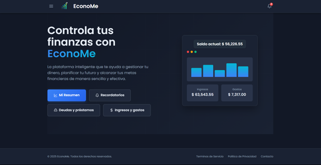

# Sistema Financiero Personal 💰

Un sistema web desarrollado en Java para la gestión financiera personal que permite el control de ingresos, gastos, deudas, préstamos y recordatorios financieros.

## 📋 Descripción

El Sistema Financiero Personal es una aplicación web que ayuda a los usuarios a gestionar sus finanzas de manera eficiente. Permite registrar movimientos financieros, controlar deudas y préstamos, generar reportes en PDF y configurar recordatorios para pagos importantes.

## ✨ Características Principales

- **Gestión de Movimientos**: Registro y control de ingresos y gastos
- **Control de Deudas y Préstamos**: Seguimiento completo del estado de deudas
- **Recordatorios**: Sistema de notificaciones para pagos pendientes
- **Reportes PDF**: Generación de documentos financieros
- **Resumen Financiero**: Dashboard con información consolidada
- **Interfaz Responsiva**: Diseño adaptable para diferentes dispositivos
- **Base de Datos**: Persistencia con PostgreSQL e Hibernate

## 🛠️ Tecnologías Utilizadas

### Backend
- **Java 21**
- **Jakarta EE** (Servlets, JSP, JSTL)
- **Hibernate 6.2.7** (ORM)
- **PostgreSQL 42.7.3** (Base de datos)
- **Apache PDFBox 2.0.30** (Generación de PDFs)
- **Gson 2.10.1** (Manejo de JSON)

### Frontend
- **JSP** (Java Server Pages)
- **HTML5/CSS3**
- **JavaScript**

### Herramientas de Desarrollo
- **Maven** (Gestión de dependencias)
- **Apache Tomcat** (Servidor de aplicaciones)
- **JUnit 5** (Testing)

## 📁 Estructura del Proyecto

```
src/
├── main/
│   ├── java/com/sistema_financiero_personal/
│   │   ├── controladores/          # Servlets de control
│   │   ├── daos/                   # Acceso a datos
│   │   ├── modelos/               # Entidades del dominio
│   │   ├── servicios/             # Lógica de negocio
│   │   └── utilidades/            # Clases utilitarias
│   ├── resources/
│   │   └── hibernate.cfg.xml      # Configuración de Hibernate
│   └── webapp/
│       ├── *.jsp                  # Vistas JSP
│       ├── resources/             # Recursos estáticos
│       └── WEB-INF/
└── test/
    └── java/                      # Tests unitarios
```

## 🚀 Instalación y Configuración

### Prerequisitos

- Java JDK 21 o superior
- Apache Maven 3.6+
- PostgreSQL 12+
- Apache Tomcat 10+

### Pasos de Instalación

1. **Clonar el repositorio**
   ```bash
   git clone https://github.com/GregorySD1707/GR01_1BT3_622_25B.git
   cd GR01_1BT3_622_25B
   ```

2. **Configurar la base de datos PostgreSQL**
   - Crear una base de datos llamada `sistema_financiero_personal`
   - Actualizar las credenciales en `src/main/resources/hibernate.cfg.xml`

3. **Compilar el proyecto**
   ```bash
   mvn clean compile
   ```

4. **Ejecutar tests**
   ```bash
   mvn test
   ```

5. **Generar el archivo WAR**
   ```bash
   mvn package
   ```

6. **Desplegar en Tomcat**
   - Copiar `target/sistema_financiero_personal.war` al directorio `webapps` de Tomcat
   - Iniciar el servidor Tomcat

## 🏃‍♂️ Uso

1. Acceder a la aplicación en `http://localhost:8080/sistema_financiero_personal`
2. Navegar por las diferentes secciones:
   - **Inicio**: Dashboard principal 

   
   - **Movimientos**: Gestión de ingresos y gastos
   - **Deudas**: Control de deudas y préstamos
   - **Recordatorios**: Configuración de notificaciones
   - **Resumen**: Reportes y análisis financiero

## 📝 Licencia

Este proyecto está bajo la Licencia MIT. Ver el archivo [LICENSE](LICENSE) para más detalles.

## 👥 Equipo de Desarrollo

**Mateo Calvache**: <https://github.com/Matian542>  

**Julián Camacho**: <https://github.com/JuliaanCZ>  

**Gregory Salazar**: <https://github.com/GregorySD1707>  

**Mateo Yunga**: <https://github.com/Matein0411>


⭐ Si te resulta útil este proyecto, ¡no olvides darle una estrella!
